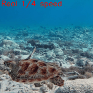

# 3D Denoising Diffusion Video Frame Interpolation (5DVFI)

<!-- [](https://arxiv.org/abs/XXXX.XXXXX) -->

[](https://huggingface.co/spaces/Feebami/DiffusionVFI)

Official implementation of 3D Denoising Diffusion for Video Frame Interpolation. This repository contains:
- Diffusion-based video frame interpolation using 3D U-Net architectures
- DDIM sampling for accelerated generation
- Quantitative evaluation metrics (PSNR, LPIPS, FID)
- Model training and evaluation pipelines



## Repository Structure

### Core Components
| File/Folder          | Description                                                                 |
|----------------------|-----------------------------------------------------------------------------|
| `base_model/`        | Core model implementations                                                  |
| --- `samplers.py`    | DDPM/DDIM sampling algorithms for frame generation                          |
| --- `train.py`       | Lightning module for training diffusion models                              |
| --- `unet.py`        | 2D and 3D U-Net architectures                                               |
| `config_search/`           | Test many configurations                                              |
| --- `configs/`            | Folder of configuration YAML files                                        |
| --- `eval_configs.py` | Evaluate a folder of trained configurations   |
| --- `train_configs.py`    | Train a folder of configurations  |
| `dataset/`           | Video dataset processing                                                    |
| --- `video_dataset.py`| Dataset loaders for UCF-101 and Vimeo-90K triplets                         |
| `interpolate/`       | Video frame interpolation scripts                                           |
| --- `interpolate_base.py` | Interpolate frames for a single video                                  |
| --- `interpolate_dir.py`  | Batch interpolation for video directories                              |
| `utility/`           | Evaluation metrics and utilities                                            |
| --- `utils.py`       | Video decoding, transformations, and metric calculations                    |
| --- `make_ucf_triplet.py` | Tripletize random subset of UCF-101 datset                             |
| `config.yaml` | Final model configuration |

### Evaluation Scripts
| Script                     | Description                                                           |
|----------------------------|-----------------------------------------------------------------------|
| `make_real_blend_samples.py` | Generates ground truth and blended baseline videos                  |
| `make_diffused_samples.py` | Generates interpolated videos using diffusion models                  |
| `eval_sample_dir.py`       | Evaluates generated videos (PSNR, LPIPS, FID)                         |


## Getting Started

### Installation

#### Clone repository
```
git clone https://github.com/Feebami/5DVFI.git
cd 5DVFI
```

#### Install dependancies

```
pip install -r requirements.txt
```

### Download Resources

1. **Model Weights**: [Download Weights](https://drive.google.com/file/d/1BG5yZnf5ZrAcSV21NPDgIFit-44oCNmH/view?usp=drive_link)
2. **UCF-101 Test Videos**: [Download UCF_test](https://drive.google.com/file/d/1S7KFbABq_QQVX1nz_Z9nRKgt7j3IXShL/view?usp=drive_link)

Place downloaded files as such:

5DVFI/  
--- epoch=5-step=80000.ckpt  
--- UCF_test/  
------ v_ApplyEyeMakeup_g11_c01.avi  
------ ...

## Reproducing Results

### 1. Generate Baseline Videos

```
python -m utility.make_real_samples
```
Outputs saved to `eval_samples/real/`

### 2. Generate Videos from Diffusion Interpolated Frames

```
python -m utility.make_diffused_samples
```
Outputs saved to `eval_samples/diffused`

### 3. Evaluate Results

```
python -m utility.eval_sample_dir --dir eval_samples/diffused
```

## Results

<!-- ### Quantitative Evaluation (UCF-101)
| Model         | PSNR ↑        | LPIPS ↓   | FID ↓     | Parameters (M)  | RT (sec)  |
|---------------|---------------|-----------|-----------|-----------------|-----------|
| MCVD          | 18.775  | 0.155     | 102.054   | 27.3            | 52.55*    |
| [LDMVFI](https://github.com/danier97/LDMVFI) | **32.186**  | 0.026     | 26.301    | 439.0           | 8.48*     |
| [MADiff](https://arxiv.org/abs/2404.13534) | 32.159  | **0.024** | 24.287    | 448.8           | 47.59^    |
| 5DVFI         | 29.496        | 0.052     | **8.525** | 56.0            | 1.174        |

*Quantitative comparison of 5DVFI and 3 other diffusion-based VFI methods on UCF-101. The last two collumns show the number of parameters and runtime needed to interpolate one 480p frame. 5DVFI runtime was benchmarked with same number of DDIM timesteps used to produce testing data (16) using an RTX 4070 GPU.*

*Assumed RTX 3090 GPU with 200 DDIM steps  
^Runtime needed to interpolate one frame of Middlebury testset using one V100 GPU. -->

### Sample Interpolations from UCF-101 testing data

| Original  | Frame Blending  | 5DVFI |
|-----------|-----------------|-------|
|  |  |   |

Every frame in these videos is an interpolation of real frames two apart in the frame sequence. The 5DVFI video examples are clips from samples used to calculate result metrics above. 

## Train Models

**Download Vimeo Triplet**:  
[Download](http://toflow.csail.mit.edu/)  
Put vimeo_triplet folder in working directory.

**Tripletize UCF-101 subset**  
1. Download full dataset
2. Remove files in UCF_test from full dataset 
3. Remove `v_Archery_g01_c01.avi` (this file wouldn't decode properly, so it was removed)
4. Run:
```
python -m utility.make_ucf_triplet
```
> **Warning:** This process takes a while to complete and produces 20.9GB of data.  

Generates:  
UCF-101_triplet/  
--- Video file name/  
------ 00001/  
--------- 0.jpg  
--------- 1.jpg  
--------- 2.jpg  
------ 00002/  
...

**Run training script with desired configuration**
```python
python -m base_model.train --config <path/to/config>
```

## License
This project is licensed under the MIT License - see the [LICENSE](LICENSE) file for details.

## Citation

```bibtex
@misc{hamel20255dvfi,
  title     = {3D Denoising Diffusion Video Frame Interpolation},
  author    = {Chandon Hamel},
  year      = {2025},
}
```
Reach out for questions or collaborations:
chandonrhamel@gmail.com

## Acknowledgements

[Vimeo 90K](http://toflow.csail.mit.edu/)  
[UCF-101](https://www.crcv.ucf.edu/data/UCF101.php)  
[LDMVFI](https://github.com/danier97/LDMVFI)  
[MADiff](https://arxiv.org/abs/2404.13534)  
[VIDIM](https://vidim-interpolation.github.io/)  
